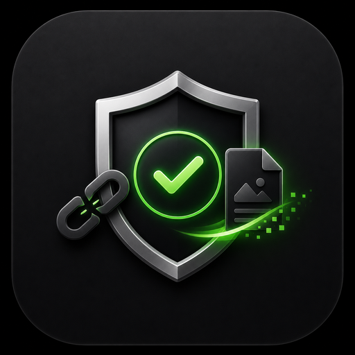
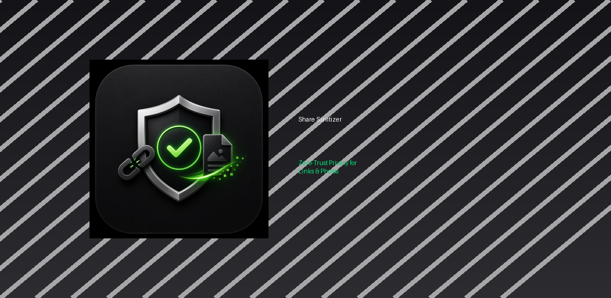
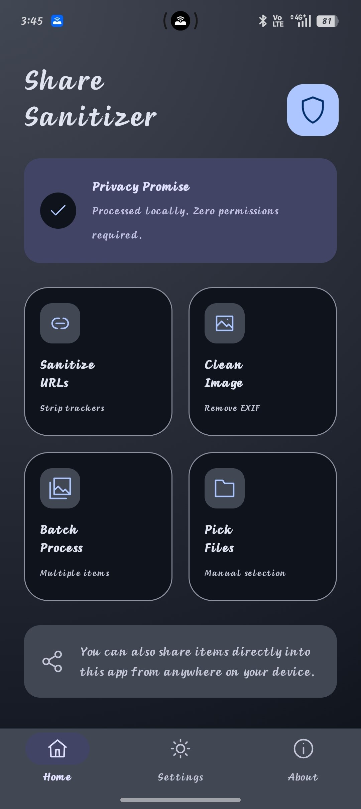
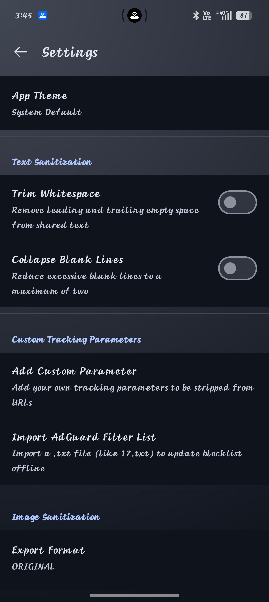
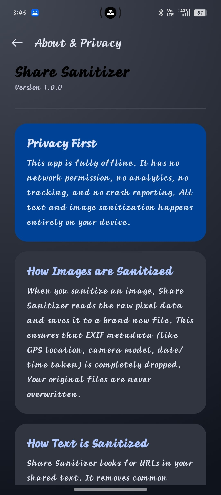

<div align="center">
  
  
  <h1>Share Sanitizer</h1>
  
  <p><b>A zero-trust, completely offline Android privacy tool to strip tracking metadata from your shared URLs and Images.</b></p>

  [](https://www.gnu.org/licenses/gpl-3.0)
  [](https://gitlab.com/fdroid/rfp/-/issues)
</div>

<br>
<div align="center">
  
</div>

<br>
<div align="center">
  
  &nbsp;
  
  &nbsp;
  
</div>

---

## 🛡️ Core Features

* **URL Tracking Removal**: Intercept shared links and automatically strip 500+ known tracking parameters (e.g. `utm_source`, `gclid`, `fbclid`) plus community-sourced ClearURLs rules.
* **URL Redirect Unwrapping**: Extract the real destination URL from tracking redirect wrappers used by Google, Facebook, YouTube, LinkedIn, Steam, VK, and more. Includes a generic fallback for unknown redirect domains.
* **Shortened URL Warning**: Detects 40+ known URL shorteners (bit.ly, t.co, amzn.to, etc.) and warns you that the real destination cannot be verified offline.
* **Invisible Unicode Stripping**: Detects and removes hidden zero-width characters (U+200B, U+FEFF, etc.) that websites embed in copied text to fingerprint and track users.
* **Image Metadata Stripping**: Safely decodes raw pixel data and strips all embedded EXIF metadata (GPS location, camera make/model, timestamps) before sharing.
* **Zero Trust & Fully Offline**: Operates entirely on-device. Requires **zero** permissions (not even `INTERNET`). Nothing is ever uploaded, and no analytics are collected.
* **Localization Ready**: All user-facing strings are externalized for community translations via F-Droid/IzzyOnDroid Weblate.
* **Material You Design**: A modern interface supporting Android 12+ dynamic theming, dark mode, and fluid micro-animations.

## 📱 How it Works

1. **Text**: Highlight text or click "Share" on a webpage in your browser, and select **Share Sanitizer**. The app intercepts it, highlights the removed trackers, and lets you immediately share the clean version.
2. **Images**: Select one or multiple photos from your Gallery, tap share, and choose **Share Sanitizer**. It strips the metadata and hands the clean images back to your sharing menu.

## 🛠️ Build Instructions

This project uses modern Android development standards (Kotlin, Jetpack Compose, Material 3) and builds via Gradle.

```bash
# Clone the repository
git clone https://github.com/TheOwlKun/Share-Sanitizer.git

# Enter the directory
cd Share-Sanitizer

# Build the debug APK
./gradlew assembleDebug
```

## 🤝 Contributing

Contributions are incredibly welcome! Please ensure any new features strictly align with the "zero permissions, fully offline" ethos of the project.

1. Fork the repository
2. Create your feature branch (`git checkout -b feature/AmazingFeature`)
3. Commit your changes (`git commit -m 'Add some AmazingFeature'`)
4. Push to the branch (`git push origin feature/AmazingFeature`)
5. Open a Pull Request

## 📄 License
This project is licensed under the GNU General Public License v3.0 - see the [LICENSE](LICENSE) file for details.
